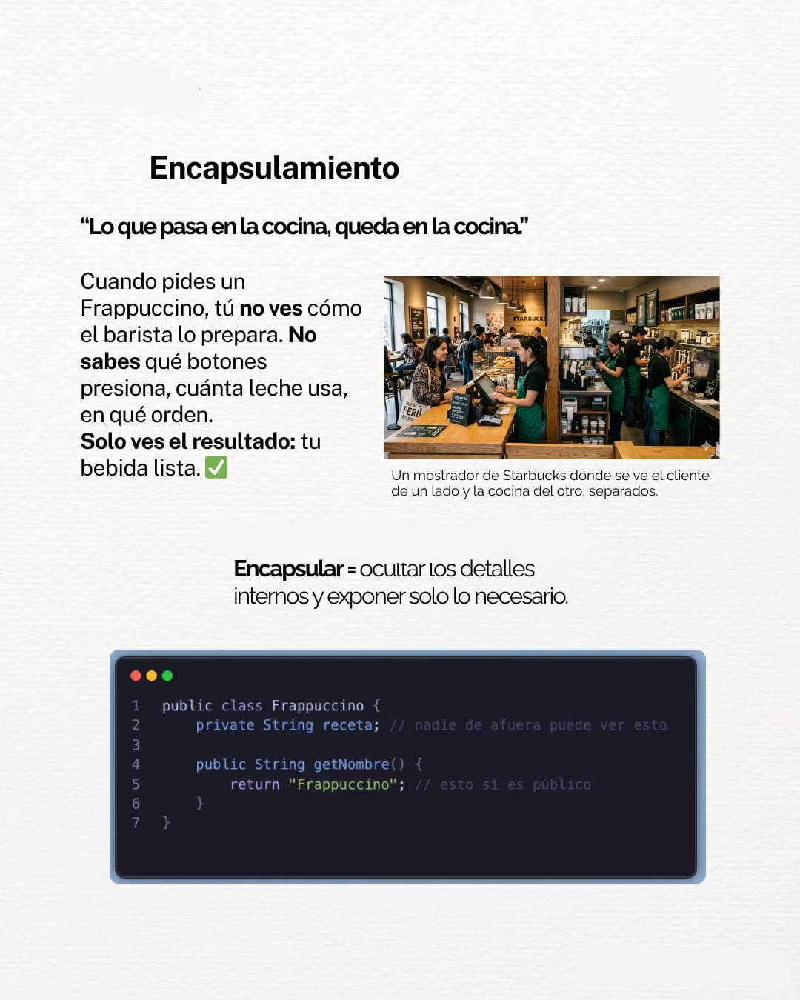
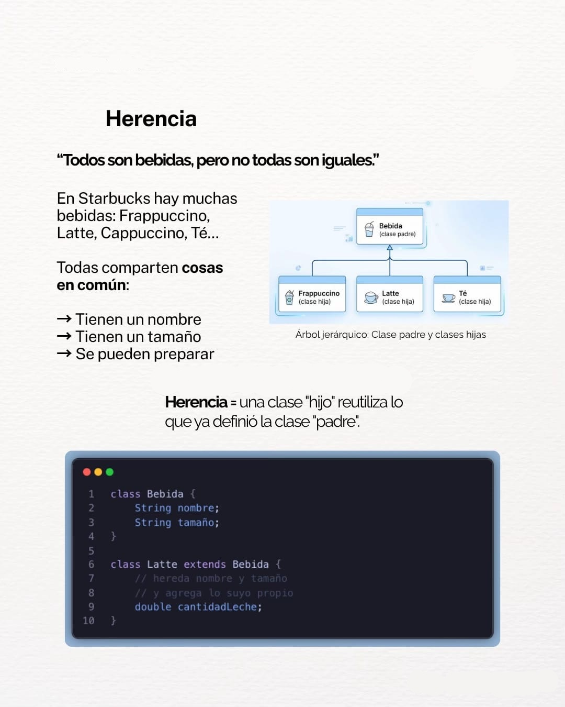
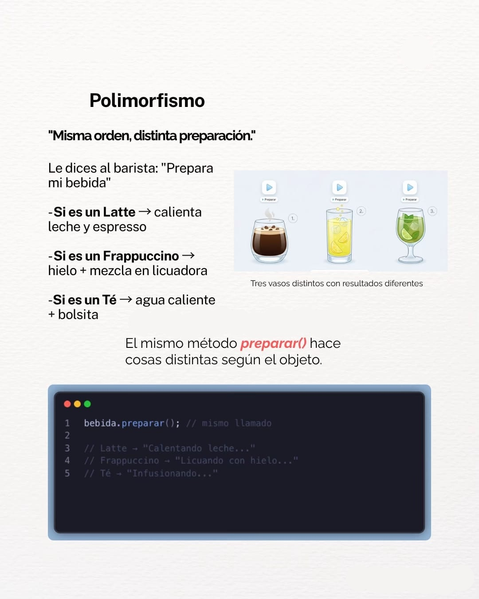

# 📘 Programación Orientada a Objetos (POO) en Kotlin

## 👥 Integrantes

- Esthefany Chavez Parra
- Samuel (No se como se escribe tu apellido **carita avergonzada* *)
- Maylee Gomez Yarce

---

# 📖 Introducción

Lo que vas a decir.

---

# 🎯 Objetivos

Si lo quieres agregar.

---

# 📚 Conceptos fundamentales

## Clase

tu

## Atributos

tu

## Métodos

tu

## Objeto

tu

---

# 💻 Ejemplo 1: Clase, atributos, métodos y objeto

En este ejemplo se representa un **hechizo** mediante una clase en Kotlin. A partir de ella se crea un objeto, el cual posee atributos que describen sus características y un método que representa una acción.

```kotlin
class Hechizo(

    // Atributo que almacena el nombre del hechizo.
    val nombre: String,

    // Atributo que indica el elemento al que pertenece el hechizo.
    val elemento: String
) {


    // Método que simula el lanzamiento del hechizo.
    fun lanzar() {
        println("$nombre ha sido lanzado.")
    }
}

fun main() {

    // Creación de un objeto (instancia de la clase Hechizo).
    val lumos = Hechizo("Lumos", "Luz")

    // Llamada al método del objeto.
    lumos.lanzar()
}
```

### 🔎 ¿Qué conceptos se observan?

| Concepto | Explicación |
|----------|-------------|
| **Clase** | `Hechizo`, ya que define el modelo que tendrán todos los hechizos. |
| **Atributos** | `nombre` y `elemento`, que representan las características del hechizo. |
| **Método** | `lanzar()`, que representa la acción que puede realizar un hechizo. |
| **Objeto** | `lumos`, creado a partir de la clase `Hechizo`. Es una instancia de la clase. |


---

# 🏛 Los cuatro pilares de la POO

## Encapsulamiento

El encapsulamiento consiste en proteger los datos internos de un objeto y permitir el acceso únicamente a través de métodos controlados. De esta manera se evita que otros elementos del programa modifiquen la información de forma incorrecta.



---

## Abstracción

La abstracción consiste en mostrar únicamente la información necesaria para utilizar un objeto, ocultando los detalles internos de su funcionamiento.


---

## Herencia

La herencia permite que una clase pueda reutilizar las características y comportamientos de otra clase, evitando repetir código y facilitando la reutilización.



---

## Polimorfismo

El polimorfismo permite que diferentes objetos respondan de manera distinta ante una misma acción, dependiendo de la implementación de cada uno.



---

# 💻 Ejemplo 2: Herencia en Kotlin

En este ejemplo se representa una **ave** como clase principal y un **águila** como una clase que hereda sus características y comportamientos. La herencia permite reutilizar código y crear clases más específicas a partir de una clase general.

```kotlin
/// Clase padre que representa un ave.
open class Ave(

    // Atributo con el nombre del ave.
    val nombre: String
) {


    // Método que representa la acción de volar.
    fun volar() {
        println("$nombre está volando.")
    }
}


// Clase hija que hereda de la clase Ave.
class Aguila(nombre: String) : Ave(nombre) {


    // Método propio de la clase Aguila.
    fun cazar() {
        println("$nombre está cazando.")
    }
}

fun main() {

    // Se crea un objeto de la clase Aguila.
    val aguila = Aguila("Águila Real")

    // Método heredado de la clase Ave.
    aguila.volar()

    // Método propio de la clase Aguila.
    aguila.cazar()
}
```

### 🔎 ¿Qué conceptos se observan?

| Concepto | Explicación |
|----------|-------------|
| **Clase padre** | `Ave`, ya que contiene los atributos y métodos generales que pueden ser heredados por otras clases. |
| **Clase hija** | `Aguila`, porque hereda las características y comportamientos de la clase `Ave` y además incorpora un método propio. |
| **Herencia** | La clase `Aguila` reutiliza el atributo `nombre` y el método `volar()` definidos en `Ave`, evitando duplicar código. |
| **Objeto** | `aguila`, creado a partir de la clase `Aguila`. Es una instancia que puede utilizar tanto los métodos heredados como los propios. |


---

# ✅ Conclusiones
tu

---

# 📂 Estructura del proyecto

```
POO_Expo/
│
├── ejemplos/
│   ├── ejemplo01_claseObjeto.kt
│   └── ejemplo02_herencia.kt
│
├── img/
│   ├── Abstraccion.png
│   ├── Encapsulamiento.png
│   ├── Herencia.jpg
│   └── Polimorfismo.jpg
│
└── README.md
```